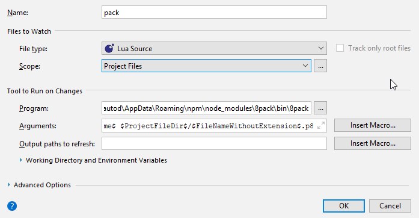

8pack
====================

## Utility that injects Lua source into a [PICO-8](https://www.lexaloffle.com/pico-8.php) project. 

## Installation
````bash
npm install 8pack -g
````

## Examples

Create *sample.lua.p8* from *sample.lua* using newest PICO-8 template
````bash
8pack tests/sample.lua
````

Inject *sample.lua* source into *foo.p8*. Will overwrite *foo.p8* if already exists.
````bash
8pack tests/sample.lua foo.p8  
````

Watch */tests/sample.lua* for changes and overwrite to */tests/sample.lua.p8*
````bash
8pack /tests/sample.lua -w  
````

Write */tests/sample.lua* source to */tests/foo.p8* using PICO-8 0.1.10c template 
````bash
8pack tests/sample.lua /tests/foo.p8 --template 0.1.10c 
````

## JetBrains Watcher Arguments
Install 8pack globally and add 8pack bin as watcher with following arguments for on-the-fly injection 
````
$ProjectFileDir$/$FileName$ $ProjectFileDir$/$FileNameWithoutExtension$.p8
````
e.g. for Lua watcher in PhpStorm 2017.3 on Windows 10 (I'm using the official Lua plugin)


## ToDos
* Write tests
* Lua Modules